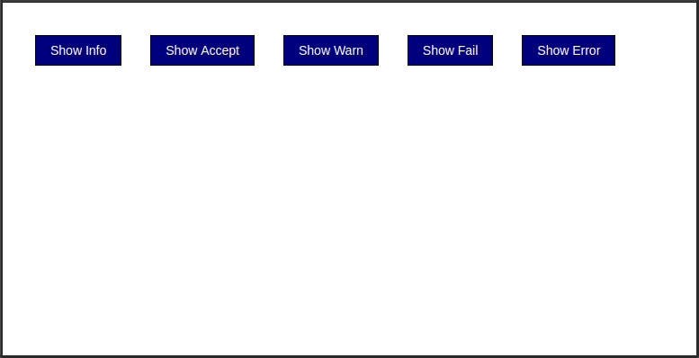
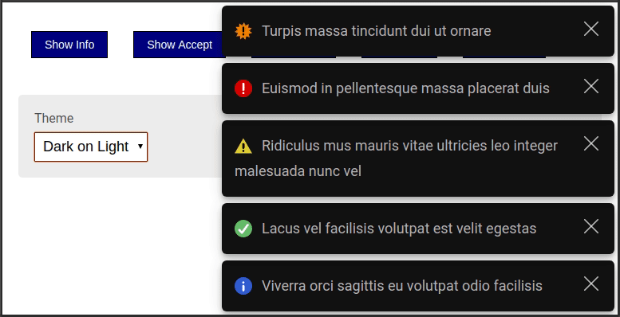
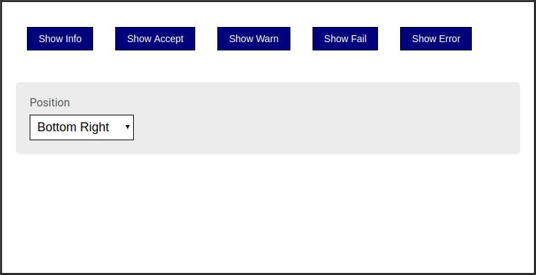

#  NGX Mercury Notifier

Notification library built for Angular that will blend in with your Material Design apps.

## Spotlight of Features

.Merge duplicate messages

{zwsp}

.Pause on roll-over

{zwsp}

.Light/Dark themes

{zwsp}

.Customizable position

{zwsp}

## Installation

[source,bash]
----
npm install ngx-mercury-notifier --save
----

Make sure to install peer dependencies:

- @angular/common
- @angular/core
- @angular/cdk

## Configure Settings

Change global settings with `useValue`

.app.module.ts
[source,typescript]
----
import { BrowserModule } from '@angular/platform-browser';
import { NgModule } from '@angular/core';

import { AppComponent } from './app.component';
import { MercuryNotifierModule, MercuryNotifierSettings } from 'ngx-mercury-notifier';

@NgModule({
  declarations: [
    AppComponent
  ],
  imports: [
    BrowserModule,
    MercuryNotifierModule,
  ],
  providers: [
    {
      provide: 'MERCURY_NOTIFIER_SETTINGS',
      useValue: { // 👈
        theme: 'DARK-ON-LIGHT',
        direction: 'BOTTOM-UP',
        top: 'unset', bottom: '0', left: 'unset', right: '0',
        maxWidth: '500px',
      } as MercuryNotifierSettings
    },
  ],
  bootstrap: [AppComponent]
})
export class AppModule { }
----

.Global Settings
|===
| Name | Type | Default | Description

| duration
| number
| `6000` 
| Number of ticks before notification closes.

| direction
| string literal
| `'BOTTOM-UP'`
| Spawn notifications from the top or bottom of the stack. Options include: `'TOP-DOWN'`, `'BOTTOM-UP'`.

| theme
| string literal
| `'AUTO'`
| Changes theme to light/dark, or detects automatically. Options include: `'LIGHT-ON-DARK'`, `'DARK-ON-LIGHT'`, `'AUTO'`.

| canDismiss
| boolean
| `true`
| Adds a manual close button to each notification.

| coalesce
| boolean
| `true`
| Merges duplicates into a new notification with a tally counter in top left corner.

| rolloverPause
| boolean
| `true`
| Prevents a notification (and any notification older than that one) from closing automatically by hovering the cursor (or applying focus) to the notification.

| zIndex
| string
| `'9999'`
| Adjusts the zIndex of the notifier container so messages render above other elements

| top
| string
| `'unset'`
| Sets the top position of the notifier container. Use standard css units as a string.

| bottom
| string
| `'0'`
| Sets the bottom position of the notifier container. Use any standard css units as a string.

| left
| string
| `'0'`
| Sets the left position of the notifier container. Use any standard css units as a string.

| right
| string
| `'0'`
| Sets the right position of the notifier container. Use any standard css units as a string.

| maxWidth
| string
| `'unset'`
| Sets the maximum width of the notifier container. Use any standard css units as a string.

|===

## Generate Messages

Use the `notify` method to propagate messages.

.app.component.ts
[source,typescript]
----
import { Component } from '@angular/core';
import { MercuryNotifierService } from 'ngx-mercury-notifier';

@Component({
  selector: 'app-root',
  template: `<button (click)="test()">Hello World</button>`,
  styles: []
})
export class AppComponent {
  constructor(
    private notifier: MercuryNotifierService
  ) {}
  test(): void {
    this.notifier.notify('Hello World!'); // 👈
  }
}
----

.notify method arguments
|===
| Name | Type | Optional | Description

| message
| string
| No
| Message body of notification.

| notificationType
| string literal
| Yes
| Shows a colored icon in front of the message. Options include: `'INFO'`, `'ACCEPT'`, `'WARN'`, `'FAIL'`, `'ERROR'` or default value `null` for no icon.

| duration
| number
| Yes
| Number of ticks before notification closes

| canDismiss
| boolean
| Yes
| Adds a manual close button to the notification.
|===